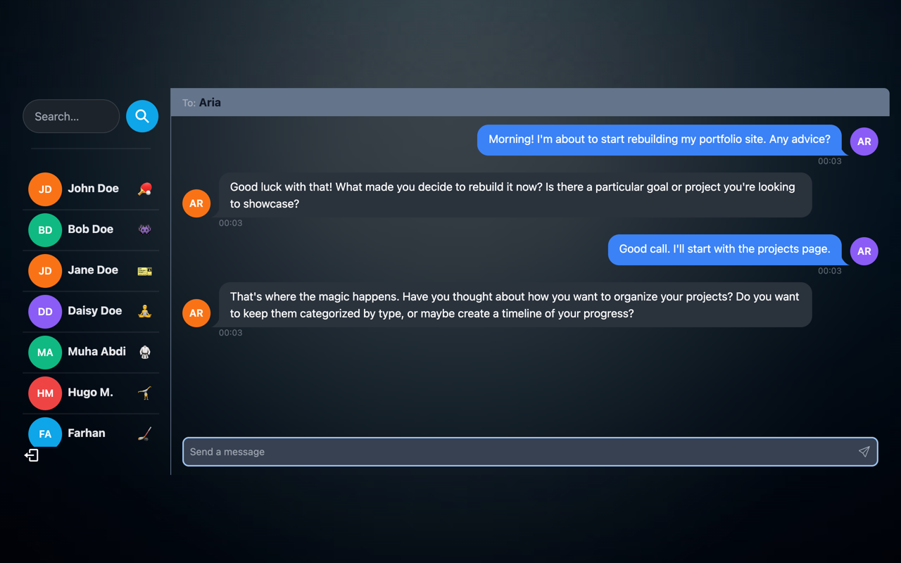
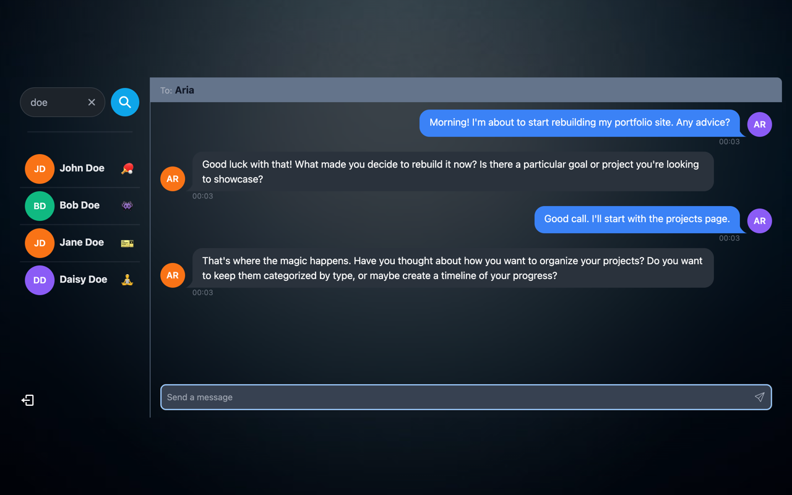
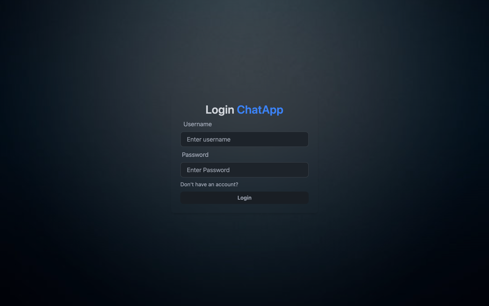
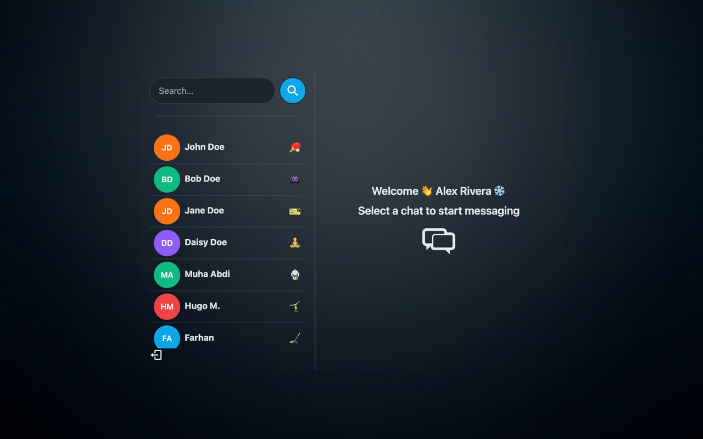

# Messenger App

A real-time chat application built on the MERN stack, with an AI chat partner that runs
on a local model — no API key or cloud account required.


---

## Screenshots

**Chatting with the AI partner** — replies generated by a model running locally, streamed
back over the same Socket.io channel as any other message.



**Live search** — typing `doe` narrows the contact list as you type, matching display
names and usernames.



<details>
<summary>More screenshots</summary>

**Login**



**Contacts with presence** — a green dot marks users currently connected.



</details>

---

## What it does

- **Real-time messaging** over Socket.io, with live online/offline presence
- **JWT authentication** stored in httpOnly cookies, so the token is not reachable from JavaScript
- **An AI chat partner** ("Aria") that replies in conversation, with the last 20 turns as context
- **Live search** that filters contacts by name or username as you type
- **Locally generated avatars** — initials on a colour derived from the name, no external image host

## The AI partner

Aria is an ordinary user record with an `isAI` flag. Messages addressed to her are routed
to a model instead of waiting for a human, and the reply comes back through the same
Socket.io channel every other message uses — the frontend needs no special case for it.

Generation runs **after** the HTTP response is sent, so the sender's UI is never blocked
on the model. If generation fails, the error is delivered as a chat message rather than
surfacing as a 500.

Two providers are supported behind one switch in `.env`:

| `AI_PROVIDER` | Runs on | Cost | Needs |
|---|---|---|---|
| `ollama` *(default)* | a model on your own machine | free | Ollama installed |
| `anthropic` | the Claude API | paid | `ANTHROPIC_API_KEY` |

Both share the same system prompt and conversation-history builder, so switching is a
one-line change and nothing else in the app is aware of which one is active.

---

## Running it locally

**Requirements:** Node 18+, a MongoDB connection string, and [Ollama](https://ollama.com)
if you want the AI partner.

```bash
git clone https://github.com/Farhan-pubRepo/messanger_app.git
cd messanger_app
npm install
npm install --prefix frontend
```

Create `.env` in the project root:

```bash
PORT=5001
MONGO_DB_URI=your_mongodb_connection_string
JWT_SECRET=any_long_random_string
NODE_ENV=development

# AI partner — "ollama" (free, local) or "anthropic" (paid API)
AI_PROVIDER=ollama
OLLAMA_MODEL=llama3.1:8b
# ANTHROPIC_API_KEY=       # only needed when AI_PROVIDER=anthropic
```

> **Port 5001, not 5000.** macOS runs AirPlay Receiver on port 5000, which silently
> answers requests with a 403 and makes the backend look broken. Either use 5001 or turn
> AirPlay Receiver off in System Settings → General → AirDrop & Handoff.

Set up the AI partner (optional):

```bash
ollama pull llama3.1:8b
ollama serve                          # or: brew services start ollama
node backend/seeds/createAIFriend.js  # creates Aria, safe to re-run
```

Start both halves in separate terminals:

```bash
npm run server                # backend on :5001
npm run dev --prefix frontend # frontend on :3000
```

Open **http://localhost:3000** — use `localhost`, not `127.0.0.1`. Vite binds IPv6 here,
so the numeric address gets connection-refused.

---

## Project structure

```
backend/
  controllers/   auth, message, user request handlers
  models/        User, Message, Conversation schemas
  routes/        /api/auth, /api/messages, /api/users
  middleware/    protectRoute — JWT verification
  services/      ai.service.js — provider-agnostic reply generation
  seeds/         createAIFriend.js
  socket/        Socket.io server and userId -> socketId map
frontend/src/
  components/    Avatar, sidebar, message views
  context/       AuthContext, SocketContext
  hooks/         data fetching per feature
  zustand/       selected conversation and search term
```

## API

| Method | Route | Purpose |
|---|---|---|
| `POST` | `/api/auth/signup` | Create an account |
| `POST` | `/api/auth/login` | Log in, sets the JWT cookie |
| `POST` | `/api/auth/logout` | Clear the cookie |
| `GET` | `/api/users` | Contacts for the sidebar |
| `GET` | `/api/messages/:id` | Conversation with one user |
| `POST` | `/api/messages/send/:id` | Send a message |

All routes except signup/login require a valid JWT cookie.

---

## Notes on a few decisions

**Avatars are drawn client-side.** They previously came from a third-party avatar host,
which started returning 502 and took every avatar in the app down with it. They are now
generated from the user's name, so there is nothing external to fail. A real `profilePic`
URL still takes precedence when one is set.

**Socket setup depends on the user id, not the socket object.** An effect that both sets
the socket and depends on it re-runs every time it succeeds, which produces an endless
connect/disconnect cycle. The connection is keyed on `authUser._id` instead, and the
socket instance is held in a ref.

**Search filters rather than jumps.** It previously used `.find()` and selected the single
first match, so with four contacts named "Doe" only one was ever reachable. The list now
filters live and matches usernames as well as display names.

---

## Built with

**Backend** — Express, MongoDB/Mongoose, Socket.io, JWT, bcrypt
**Frontend** — React 18, Vite, Zustand, Tailwind + DaisyUI, React Router
**AI** — Ollama (local) or the Anthropic API
